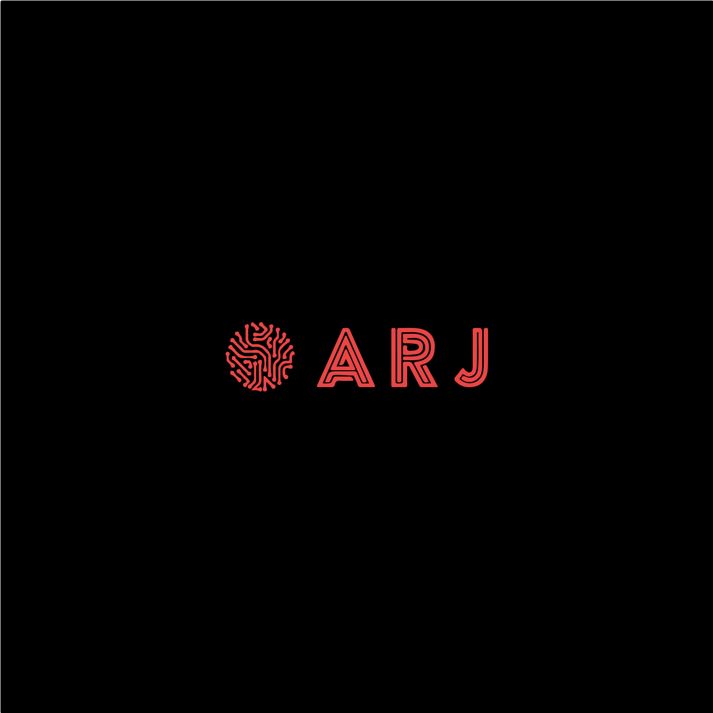

<div align="center">
  
</div>
<h1 align="center">
  ARJ's Portfolio - V2
</h1>
<p align="center">
  This is the second iteration of <a href="www.atharvaj.online" target="_blank">my portfolio website</a> built with <a href="https://nextjs.org/" target="_blank">Next JS</a>, <a href="https://tailwindcss.com/">Tailwind CSS</a> and hosted with <a href="https://vercel.com/" target="_blank">Vercel</a>
</p>
</div>
<p align="center">
  <a href="www.atharvaj.online" target="_blank">
    
  </a>
</p>
<p align="center">
  The Design is partially inspired by <a href="https://brittanychiang.com/" target="_blank">britannychiang.com</a>
</p>

## Initial Setup done with -

```sh
 pnpm create next-app --example with-tailwindcss with-tailwindcss-app
```

## 🛠 Installation & Set Up

1. Install dependencies using pnpm

   ```sh
   pnpm i
   ```

2. Start the development server

   ```sh
   pnpm dev
   ```

## 🚀 Building and Running for Production

1. Generate production build

   ```sh
   pnpm build
   ```
